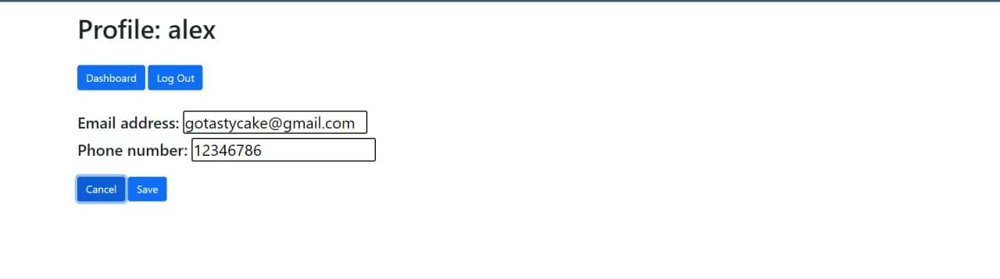
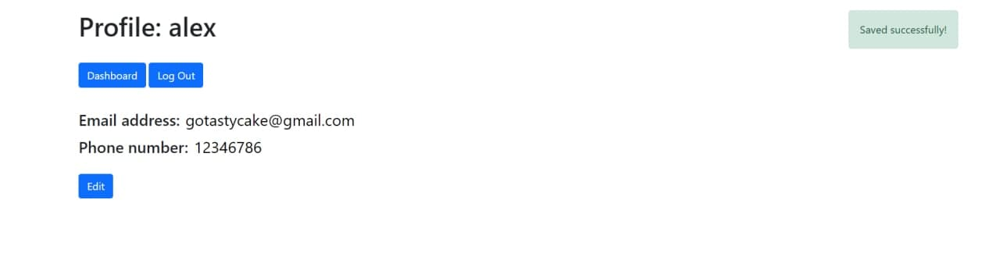

## Звіт
Створення безпечного сховища даних відбувалося на основі коду лабораторної роботи №5.

У якості алгоритму шифрування був обраний AES-256-CBC.
Після отримання даних клієнта, кожен елемент шифрується, а потім зберігається до БД.
Secret Key зберігається у .env файлі конфігурації, а Init Vector отримується з байтів _id користувача.

Функція для шифрування даних:
```js
const algorithm = "aes-256-cbc";
const securityKey = Buffer.from(config.aesSecretKey);
export const encryptData = (user, ...data) => {
    let { _id } = user;
    const initVector = Buffer.from(_id.toString()).slice(8, 24);

    for (let i = 0; i < data.length; i ++) {
        const cipher = crypto.createCipheriv(algorithm, securityKey, initVector);
        data[i] = cipher.update(data[i], "utf-8", "hex");
        data[i] += cipher.final("hex");
    }
    return data;
}
```

Функція для дешифрування даних:
```js
export const decryptData = (user, ...data) => {
    const funcName = "[decryptData]";
    let { _id } = user;

    const initVector = Buffer.from(_id.toString()).slice(8, 24);
    try {
        for (let i = 0; i < data.length; i ++) {
            const decipher = crypto.createDecipheriv(algorithm, securityKey, initVector);
            data[i] = decipher.update(data[i], "hex", "utf-8")
            data[i] += decipher.final("utf8");
        }
        return data;
    } catch (err) {
        console.error(funcName, user.username, err);
        return [];
    }
};
```

Сторінка редагування даних користувача:  


Внесені зміни успішно збережені:  
