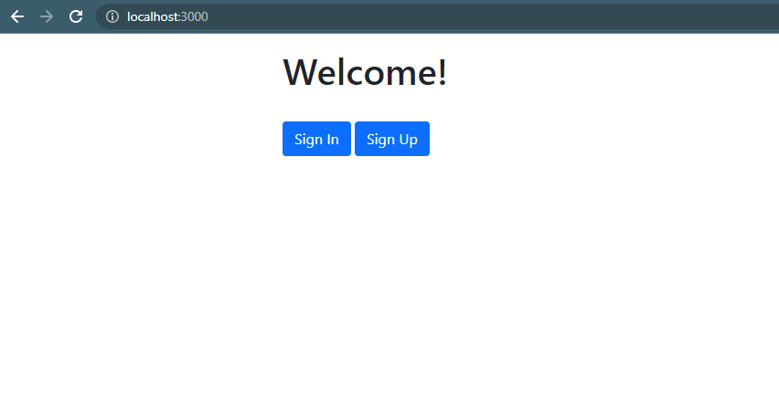
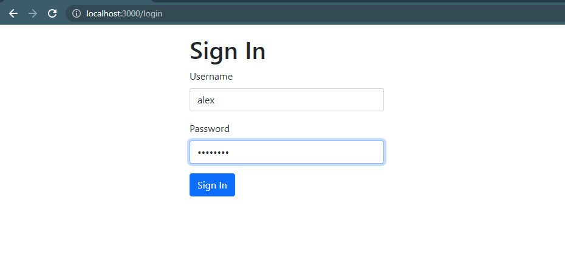
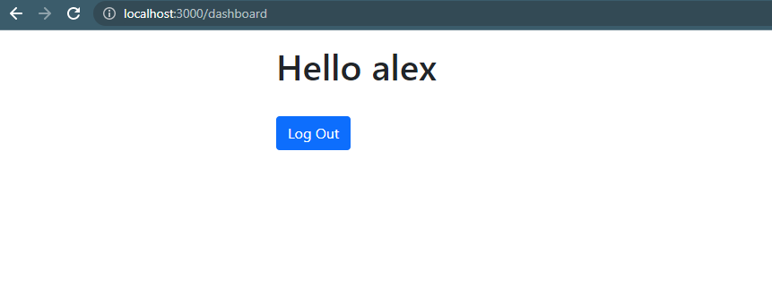

## Звіт
Для досягнення цілей роботи були використані node.js framework Express, MongoDB, passport.
Express дозволяє швидко реалізувати веб-сервер, а також зручно підключити модулі авторизації. MongoDB обрана як популярна база даних, а passport - популярна бібліотека для авторизації.

Пароль хешується на бекенді за допомогою бібліотеки bcrypt із 10 циклами “соління”, хеш зберігається разом із даними юзера в mongodb.
```js
User.pre('save', function (next) {
    let user = this;
    if (!user.isModified('password')) { return next(); }
    bcrypt.genSalt(10, function (err, salt) {
        if (err) { console.error(err); return next(err); }
        bcrypt.hash(user.password, salt, function (err, hash) {
            if (err) { console.error(err); return next(err); }

            user.password = hash;
            next();
        });
    });
});
```

Сесії Express були реалізовані для того, щоб користуватися додатком адекватно, не збиваючи авторизацію юзерів після його перезапуску.

Поточна вимога до паролю: якнайменше 8 символів. Інші вимоги можна додати за необхідності.

Для реалізації нормальної безпеки також необхідно мати https connection, який легко налаштувати на сервері.


Вигляд основної сторінки:


Вигляд сторінки логіну:


Вигляд сторінки, що доступна авторизованим користувачам

